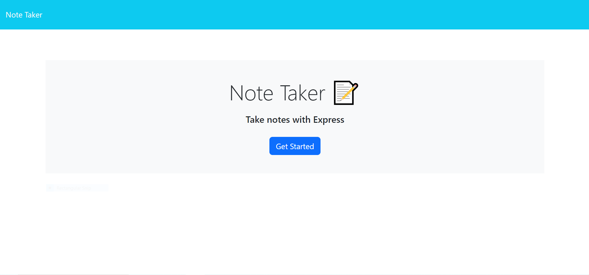
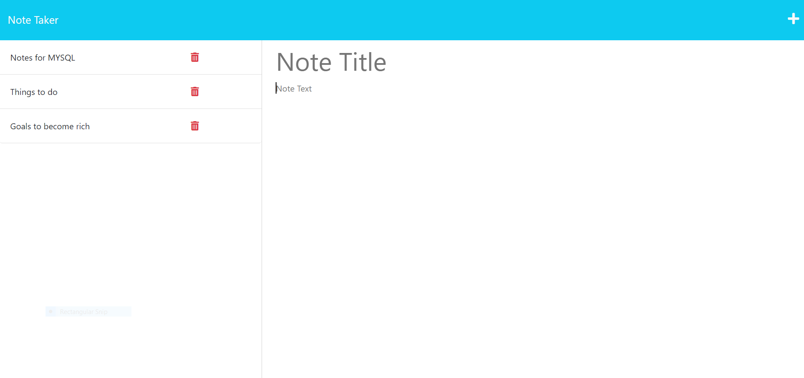

# Note Taker

## Description
Utilise node.js using express.js to create a note taking application. Once the
code has been executed through the command line terminal, a back end server will
be hosted to access the front end of the application.

## 
  ## Table of Contents
  - [Installation](#installation)
  - [Usage](#usage)
  - [Contributing](#contributing)
  - [Tests](#tests)
  - [Questions](#questions)
  

## Installation
- Node.js
- Express.js
- Jest 
- uuidv4
- Visual Studio Code

## Usage
Host an online application using express.js

## License
N/A

## Contributing
Chase Barrett-Brown

## Tests

N/A

## Screenshot
### Hosted index.html

### Hosted notes.html

## Deployment

Link: https://polar-ridge-61059.herokuapp.com/

## Questions
If you have any questions, feel free to reach out to me:

GitHub: [Mrgnoblennon](https://github.com/Mrgnoblennon)

Email: chasebarrettbrown@hotmail.com

